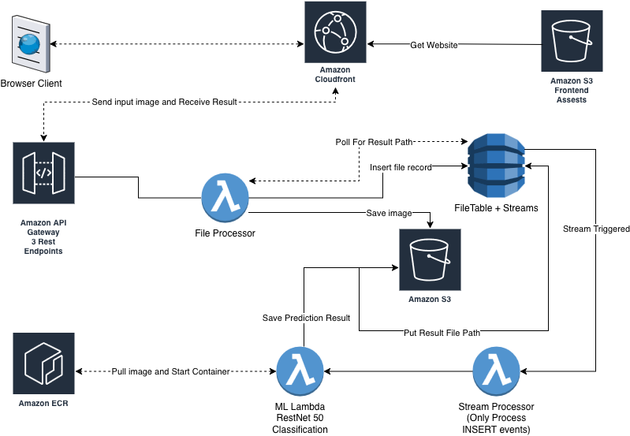

# AWS Image Classification Pipeline

Serverless ML inference pipeline powered by ResNet50 and AWS CDK.


---

**Live Demo:** [https://dv8q40y5ter7r.cloudfront.net/](https://dv8q40y5ter7r.cloudfront.net/)

## Table of Contents

- [Project Overview](#1-project-overview)
- [Prerequisites](#2-prerequisites)
- [Setup and Deployment](#3-setup-and-deployment)
- [How to Use](#4-how-to-use)
- [Running Tests](#5-running-tests)
- [AWS Resources Created](#6-aws-resources-created)
- [API Endpoints](#7-api-endpoints)
- [ML Model Details](#8-ml-model-details)
- [Teardown](#9-teardown)
- [References](#10-references)

---

## 1. Project Overview

This project is an end-to-end serverless image classification pipeline built on AWS. A user uploads an image through a React web interface hosted on CloudFront. The system stores the image in S3, records job metadata in DynamoDB, and triggers a containerized Lambda function running a pretrained ResNet50 model to classify the image. Results are returned within seconds and displayed in the browser with confidence scores for the top five predictions.

The architecture is fully event-driven. No servers are pre-provisioned or kept idle. Every AWS resource is defined and managed through AWS CDK, deployable with a single command.

### 1.1 Architecture



High-level flow:

1. User uploads an image through the React frontend hosted on CloudFront
2. The browser calls API Gateway to get a presigned S3 URL
3. The image is uploaded directly from the browser to S3
4. A second API call saves the job record to DynamoDB with status `PENDING`
5. DynamoDB Streams detects the new `INSERT` record and triggers Lambda 2
6. Lambda 2 asynchronously invokes the ML Lambda container
7. The ML Lambda pulls the ResNet50 model, classifies the image, and saves predictions to S3
8. DynamoDB is updated with the output path and status `COMPLETE`
9. The frontend polls `GET /get-result` until status is `COMPLETE` and displays predictions

### 1.2 Tech Stack

| Layer | Technology |
|---|---|
| Frontend | React 18, TypeScript, Vite, Axios |
| Hosting | Amazon S3 + CloudFront CDN |
| API | Amazon API Gateway (REST) |
| Backend | AWS Lambda (Node.js 20, TypeScript) |
| ML Compute | AWS Lambda Container Image (Python 3.11) |
| ML Framework | PyTorch 2.1, torchvision, ResNet50 (ImageNet) |
| Database | Amazon DynamoDB (on-demand) |
| File Storage | Amazon S3 |
| Container Registry | Amazon ECR |
| Infrastructure | AWS CDK v2 (TypeScript) |
| AWS SDK | AWS SDK for JavaScript v3 |
| ID Generation | nanoid |
| Testing | Jest, ts-jest |

---

## 2. Prerequisites

Before setting up the project, ensure the following tools are installed and configured.

| Tool | Version | Purpose |
|---|---|---|
| Node.js | 20.x or later | Runtime for Lambda functions and CDK |
| npm | 10.x or later | Package management |
| AWS CDK CLI | Latest | Deploy infrastructure |
| AWS CLI | v2 | Authenticate and manage AWS resources |
| Docker Desktop | Latest | Build ML Lambda container image |
| Python | 3.11 | ML Lambda local development |
| Git | Any | Version control |

AWS account requirements:

- An AWS account with administrator access
- AWS CDK bootstrapped in `us-east-1` (see Setup section)
- Docker Desktop running before any build or deploy step

---

## 3. Setup and Deployment

Follow these steps in order. No manual changes are needed in the AWS console. Everything deploys via CLI commands.

### 3.1 Clone the Repository

```bash
git clone https://github.com/yourusername/file-processor-project.git
cd file-processor-project
```

### 3.2 Authenticate with AWS

```bash
aws login
```

This opens a browser window. Log in with your AWS credentials. The session is temporary and expires after 12 hours.

Verify authentication:

```bash
aws sts get-caller-identity
```

### 3.3 Bootstrap AWS CDK

This only needs to be run once per AWS account per region.

```bash
cd backend/cdk
cdk bootstrap aws://YOUR-ACCOUNT-ID/us-east-1
```

Replace `YOUR-ACCOUNT-ID` with the account value from the previous step.

### 3.4 Install Dependencies

```bash
cd backend/cdk && npm install
cd ../lambda/file-processor && npm install
cd ../stream-processor && npm install
```

### 3.5 Build and Push the ML Lambda Container

Make sure Docker Desktop is running before executing these commands.

Authenticate Docker with ECR:

```bash
aws ecr get-login-password --region us-east-1 | docker login \
  --username AWS \
  --password-stdin YOUR-ACCOUNT-ID.dkr.ecr.us-east-1.amazonaws.com
```

Build and push the image:

```bash
cd backend/ml-lambda

docker buildx build \
  --platform linux/amd64 \
  --provenance=false \
  --push \
  -t YOUR-ACCOUNT-ID.dkr.ecr.us-east-1.amazonaws.com/ml-classifier:latest .
```

Replace `YOUR-ACCOUNT-ID` with your AWS account ID. The build takes 5 to 10 minutes on first run.

### 3.6 Deploy the CDK Stack

```bash
cd backend/cdk
cdk deploy
```

When prompted, type `y` to confirm. Deployment takes 3 to 5 minutes. When complete, note the outputs printed in the terminal:

- `CdkStack.ApiUrl` — your API Gateway URL
- `CdkStack.FrontendUrl` — your CloudFront URL
- `CdkStack.BucketName` — your S3 bucket name

### 3.7 Configure the Frontend

Create the frontend environment file:

```bash
cd frontend
echo 'VITE_API_URL=https://YOUR-API-GATEWAY-URL/prod' > .env
```

Replace `YOUR-API-GATEWAY-URL` with the `ApiUrl` value from the CDK output. Remove the trailing slash if present.

### 3.8 Build and Deploy the Frontend

```bash
cd frontend && npm install && npm run build
cd ../backend/cdk && cdk deploy
```

The second deploy uploads the built React app to S3 and invalidates the CloudFront cache. Your site is now live at the `FrontendUrl`.

### 3.9 Update the ML Lambda After Code Changes

If you modify `app.py` in `ml-lambda`, rebuild and push the image, then force Lambda to use the latest:

```bash
aws lambda update-function-code \
  --function-name ml-classifier-lambda \
  --image-uri YOUR-ACCOUNT-ID.dkr.ecr.us-east-1.amazonaws.com/ml-classifier:latest \
  --region us-east-1
```

---

## 4. How to Use

1. Open the CloudFront URL in your browser
2. Enter a description for your image in the text field
3. Click Browse and select a JPG or PNG image (max 10MB)
4. Click Classify Image
5. Wait for the pipeline to complete (10 to 90 seconds depending on Lambda cold start)
6. View the top 5 classification results with confidence scores

---

## 5. Running Tests

### 5.1 Unit Tests

Unit tests run in isolation with all AWS SDK calls mocked. No AWS credentials or deployed resources required.

```bash
cd backend/cdk
npm run test:unit
```

Expected output: 13 tests passing across 2 test suites covering Lambda 1 and Lambda 2 logic.

### 5.2 All Tests

```bash
npm test
```

---

## 6. AWS Resources Created

| Resource | Name | Purpose |
|---|---|---|
| S3 Bucket | `file-process-aws-didu` | Stores uploaded images and prediction JSON files |
| S3 Bucket | Auto-generated | Hosts the React frontend assets |
| DynamoDB Table | `FileTable` | Tracks all classification jobs and results |
| Lambda Function | `file-processor-lambda` | Handles API requests, presigned URLs, and DynamoDB operations |
| Lambda Function | `stream-processor-lambda` | Triggered by DynamoDB Streams, invokes ML Lambda |
| Lambda Function | `ml-classifier-lambda` | Runs ResNet50 image classification in Docker container |
| API Gateway | `file-processor-api` | Exposes three REST endpoints to the frontend |
| CloudFront | Auto-generated | CDN for global low-latency frontend delivery |
| ECR Repository | `ml-classifier` | Stores the ML Lambda Docker image |
| IAM Roles | Multiple | Least-privilege permissions for each Lambda function |

---

## 7. API Endpoints

| Endpoint | Method | Description |
|---|---|---|
| `/get-upload-url` | POST | Returns a presigned S3 URL for direct browser-to-S3 image upload |
| `/save-record` | POST | Saves job metadata to DynamoDB and triggers the ML pipeline |
| `/get-result` | GET | Returns current job status and predictions (used for polling) |

### Request and Response Examples

**POST /get-upload-url**

```json
// Request
{ "fileName": "dog.jpg" }

// Response
{
  "presignedUrl": "https://s3.amazonaws.com/...",
  "filePath": "file-process-aws-didu/dog.jpg"
}
```

**POST /save-record**

```json
// Request
{ "inputText": "My dog photo", "inputFilePath": "file-process-aws-didu/dog.jpg" }

// Response
{ "success": true, "id": "V1StGXR8_Z5jdHi6B" }
```

**GET /get-result?id=V1StGXR8_Z5jdHi6B**

```json
// Response
{
  "id": "V1StGXR8_Z5jdHi6B",
  "status": "COMPLETE",
  "predictions": [
    { "label": "golden retriever", "confidence": 0.9412 },
    { "label": "Labrador retriever", "confidence": 0.0321 }
  ],
  "outputFilePath": "file-process-aws-didu/results-V1StGXR8.json",
  "completedAt": "2026-05-26T00:03:04Z"
}
```

---

## 8. ML Model Details

| Property | Value |
|---|---|
| Model | ResNet50 |
| Pre-trained on | ImageNet (1.2M images, 1000 classes) |
| Input size | 224x224 RGB |
| Preprocessing | Resize 256, CenterCrop 224, Normalize (ImageNet mean/std) |
| Output | Top 5 predictions with confidence scores |
| Inference | CPU only (no GPU required) |
| Model weights source | `torchvision.models.ResNet50_Weights.IMAGENET1K_V1` |
| Weight cache | `/tmp/torch` (Lambda writable directory) |

### Preprocessing Pipeline

```python
transforms.Compose([
    transforms.Resize(256),
    transforms.CenterCrop(224),
    transforms.ToTensor(),
    transforms.Normalize(
        mean=[0.485, 0.456, 0.406],
        std=[0.229, 0.224, 0.225]
    )
])
```

The normalization values are the mean and standard deviation of the ImageNet dataset. ResNet50 was trained with these values and requires them for correct inference.

---

## 9. Teardown

To remove all AWS resources created by this project:

```bash
cd backend/cdk
cdk destroy
```

To also remove the ECR repository and Docker image:

```bash
aws ecr delete-repository \
  --repository-name ml-classifier \
  --region us-east-1 \
  --force
```

---

## 10. References

- [AWS CDK Documentation](https://docs.aws.amazon.com/cdk/v2/guide/home.html)
- [AWS SDK for JavaScript v3](https://docs.aws.amazon.com/AWSJavaScriptSDK/v3/latest/)
- [PyTorch ResNet50](https://pytorch.org/vision/stable/models/resnet.html)
- [torchvision Models](https://pytorch.org/vision/stable/models.html)
- [nanoid](https://github.com/ai/nanoid)
- [AWS Lambda Container Images](https://docs.aws.amazon.com/lambda/latest/dg/images-create.html)
- [Amazon ECR Documentation](https://docs.aws.amazon.com/AmazonECR/latest/userguide/what-is-ecr.html)
- [DynamoDB Streams](https://docs.aws.amazon.com/amazondynamodb/latest/developerguide/Streams.html)